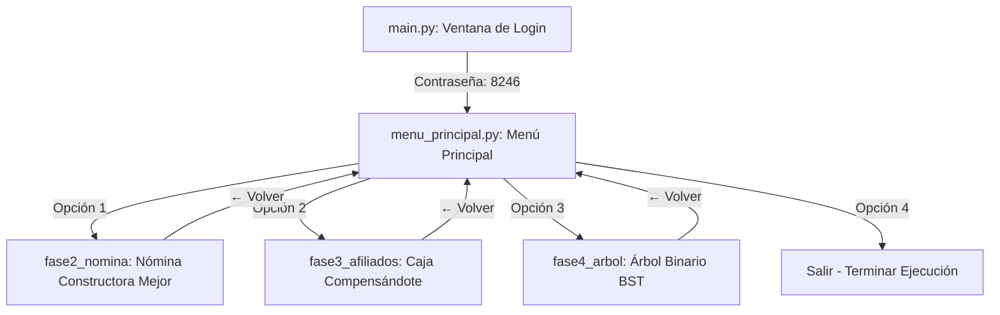

# 🎓 Proyecto Integrador — Evaluación Final
## Estructuras de Datos (UNAD)

Este repositorio contiene la **Evaluación Final (Fase 5 - Validación Integral y Sustentación)** para el curso de **Estructuras de Datos** de la Universidad Nacional Abierta y a Distancia (UNAD). 

El proyecto consiste en una **solución unificada y centralizada** que integra las aplicaciones de software desarrolladas de forma individual a lo largo de las Fases 2, 3 y 4 del curso. Todo esto bajo una experiencia de usuario premium, unificada bajo un diseño visual moderno en modo oscuro (dark mode) y un sistema de control de navegación fluido.

---

## 🔒 Sistema de Acceso Centralizado

Para ingresar al ecosistema de aplicaciones, el sistema implementa una ventana de login unificada con las siguientes características:
* **Contraseña de Acceso Genérica:** `8246`
* **Validación en tiempo real** con control de errores e indicaciones visuales reactivas.
* **Seguridad integrada:** Cada sub-aplicación integrada ha sido refactorizada para desactivar sus validaciones de contraseña individuales anteriores (`"ARBOL"`, `"Caja"`, etc.), permitiendo un flujo directo desde el Menú Principal una vez superado este login.

---

## 📦 Componentes Integrados

La aplicación unificada consolida las siguientes soluciones:

### 1. 🏗️ Fase 2 — Sistema de Nómina (Constructora Mejor)
* **Paradigma:** Programación Orientada a Objetos (POO).
* **Arquitectura:** Arquitectura Hexagonal limpia (Ports & Adapters).
* **Descripción:** Permite el registro de empleados, selección de cargos con salarios diarios parametrizados y cálculo automatizado del salario total según los días laborados. Genera un reporte persistente en disco (`reporte_nomina.txt`).

### 2. 👥 Fase 3 — Control de Afiliados (Compensándote)
* **Estructuras de Datos Lineales:** 
  * **Pila (Stack):** Registro LIFO de afiliados.
  * **Cola (Queue):** Gestión FIFO de turnos o solicitudes.
  * **Lista (List):** Lista de afiliados ordenados o filtrados dinámicamente.
* **Arquitectura:** 3 Capas (Presentación, Lógica de Negocio y Datos) con patrón MVC simplificado.
* **Descripción:** Registro detallado de afiliados (documento, nombre, modalidad, fecha de ingreso) con cálculo automatizado de tarifas según su clasificación.

### 3. 🌳 Fase 4 — Árbol Binario de Búsqueda (BST)
* **Estructura de Datos No Lineal:** Árbol Binario de Búsqueda (Binary Search Tree).
* **Visualización Gráfica:** Renderizado 2D reactivo en Canvas para mostrar gráficamente la topología del árbol hasta 4 niveles de profundidad.
* **Recorridos:** Visualización paso a paso y por nodos de los recorridos:
  * **Preorden** (Raíz → Izquierdo → Derecho)
  * **Inorden** (Izquierdo → Raíz → Derecho)
  * **Posorden** (Izquierdo → Derecho → Raíz)
* **Operaciones adicionales:** Inserción inteligente, validación de duplicados y búsqueda destacando visualmente el nodo coincidente.

---

## 🛠️ Requisitos del Sistema

* **Python** 3.10 o superior.
* **Librerías GUI:** `tkinter` (incorporada en Python por defecto en la mayoría de instalaciones).
* **Dependencias:** `tkcalendar` (para el selector de fechas interactivo en la Fase 3).

---

## 🚀 Instalación y Ejecución

Sigue estos pasos para clonar, instalar dependencias y ejecutar el proyecto en tu entorno local:

1. **Clona el repositorio** (si aún no lo has hecho):
   ```bash
   git clone https://github.com/SantiagoVillaRamos/Fase5-validacion-integral-y-sustentacion.git
   cd Fase5-validacion-integral-y-sustentacion
   ```

2. **Accede a la carpeta del proyecto unificado:**
   ```bash
   cd evaluacion_final
   ```

3. **Crea y activa un entorno virtual (Recomendado):**
   ```bash
   python3 -m venv .venv
   source .venv/bin/activate
   ```

4. **Instala las dependencias necesarias:**
   ```bash
   pip install -r requirements.txt
   ```

5. **Ejecuta la aplicación:**
   ```bash
   python main.py
   ```

---

## 📐 Diseño de Navegación y Arquitectura Visual

La aplicación principal utiliza un gestor de ventanas reactivo mediante la librería Tkinter:
* Al presionar cualquier opción en el menú principal, la ventana central se oculta temporalmente (`withdraw()`) y se abre la interfaz de la fase seleccionada como una ventana secundaria `Toplevel`.
* Al regresar o cerrar la fase en ejecución (`destroy()`), el sistema detecta el protocolo de salida e invoca a `deiconify()` sobre el menú maestro, restaurando la pantalla original sin perder el estado de la sesión.



---

## ✍️ Información del Desarrollador

* **Estudiante:** Santiago Villa Ramos
* **Institución:** Universidad Nacional Abierta y a Distancia (UNAD)
* **Programa:** Ingeniería de Sistemas
* **Curso:** Estructuras de Datos
* **Periodo:** Quinto Semestre · 2026
